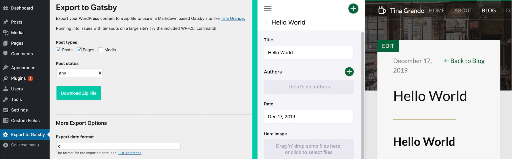

# WP Gatsby Markdown Exporter
A command line WordPress plugin to export WordPress content to Markdown for use with [GatsbyJS](https://www.gatsbyjs.org/).

Want to build real-time editing into your Gatsby site? Checkout [TinaCMS](https://tinacms.org/)!

## Features

  - Move WordPress content to Gatsby-friendly Markdown.
  - Customize the export! Remap and restructure exported fields.
  - CLI: Avoid PHP timeouts by using the command line with WP-CLI.
  - CLI: Export progress bar (great for large sites)!

## Usage

1. Download plugin and enable it, then click "Export to Gatsby" from the WordPress admin sidebar.
2. Submit the form to download a zip file with exported content.
3. Place the unzipped files in the content directory of the Markdown based site.

> Reminder: always keep a backup of the WordPress database and files in case your export doesn't work as expected!

Checkout the [WP-CLI command](#command-line-usage) to run the export from your command line to avoid PHP timeouts!

## Installation Methods (choose one)
### Download zip file (Easiest)
Download the [latest release](https://github.com/tinacms/wp-gatsby-markdown-exporter/releases/latest/download/wp-gatsby-markdown-exporter.zip) and unzip the file into wp-content/plugins.

### Composer require
  Make sure you have [Composer installed](https://getcomposer.org/doc/00-intro.md) and navigate to the WordPress site directory, then:

    composer require tinacms/wp-gatsby-markdown-exporter

### Git clone + Composer
Or clone this repository into wp-content/plugins, then navigate to the `wp-gatsby-markdown-exporter` directory:

    composer install

## Enable the plugin
Activate "WordPress to Gatsby Exporter" from the WordPress admin.
Or from the plugin's directory:

    wp plugin activate wp-gatsby-markdown-exporter

## Working with Gatsby
  If you're just getting started with Gatsby, we recommend experimenting with a Markdown based Gatsby starter like [Tina Grande](https://github.com/tinacms/tina-starter-grande). Installation is as easy as:

    git clone https://github.com/tinacms/tina-starter-grande.git

    cd tina-starter-grande

    yarn install && gatsby develop

Then copy your exported WordPress Markdown into the `content` directory or point the wp gatsby-markdown-export command at the content directory.

  Want to port your WordPress or HTML theme to Gatsby? Checkout [Porting an HTML Site to Gatsby](https://www.gatsbyjs.org/docs/porting-an-html-site-to-gatsby/) for tips.
## Command Line Usage

The command line functionality uses WP-CLI to interact with WordPress. [WP-CLI is easy to install](https://wp-cli.org/#installing) if you haven't already.

Once it's installed, you can export content to a directory like this:

    wp gatsby-markdown-export --directory=/example/gatsby-starter/src/content

All CLI arguments are optional.

| Option | Description | Default value
|--|--|--|
|`--help`|get help
|`--directory=`|export output directory|random temp directory
|`--post_types=`|post types to export, see: https://developer.wordpress.org/reference/classes/wp_query/#post-type-parameters |page,post
|`--post_status=`|post status to export, see: https://developer.wordpress.org/reference/classes/wp_query/#status-parameters|any
|`--fields_to_markdown=`|fields to convert to Markdown|excerpt
|`--excluded_front_matter=`|fields to exclude from front matter
|`--post_date_format=`|format for post publish date, see: https://www.php.net/manual/en/function.date.php|c
|`--upload_dir=`|directory in the export to copy WordPress uploads|uploads
|`--remap_fields=`|remap front matter field names, example: find1,replace1;find2,replace2
|`--fields_to_array=`|convert single value front matter fields to arrays
|`--skip_copy_uploads`|flag, skips copying WordPress uploads to the export
|`--skip_original_images`|flag, skips the use of original dimension images
|`--skip_enforce_charset`|flag, skips use of blog_charset for the XML charset
|`--create_type_directory`|flag, creates directories based on post type

## Hooks
  The following hooks can be implemented in a plugin to modify the behaviour of the exporter:

|Hook|Notes|
|--|--|
|`gatsby_markdown_exporter_posts`|array of the post ids to be exported
|`gatsby_markdown_exporter_query_options`|array of query options for the posts to be exported database query
|`gatsby_markdown_exporter_post_html_body`|string of the post's HTML body
|`gatsby_markdown_exporter_post_converted_body`|string of the post's body after conversion to Markdown
|`gatsby_markdown_exporter_post_meta`|array of the post's meta fields that will become front matter fields

## Roadmap

 - Add a how-to video.
 - More/better unit tests.
 - Allow for partial/resumable export.

## Troubleshooting

What does `Warning: The markdown converter encountered invalid HTML and could not convert the content at:` mean?

This means that the markdown converter couldn't convert the referenced post to markdown, so we will just copy the HTML as it is.

## Acknowledgments
The structure for this plugin was heavily influenced by Ben Balter's excellent [WordPress to Jekyll Exporter](https://github.com/benbalter/wordpress-to-jekyll-exporter).

## License
This project is licensed under the GPLv3 License - see the [LICENSE](https://github.com/tinacms/wp-gatsby-markdown-exporter/blob/master/LICENSE) file for details.
